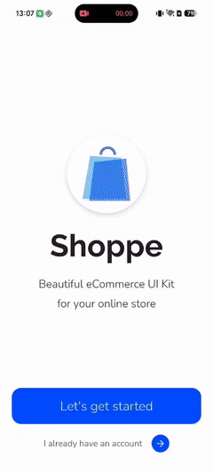
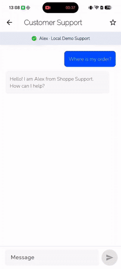
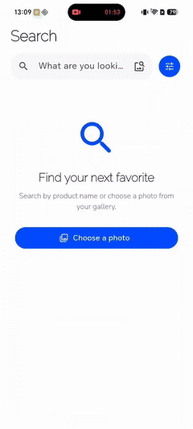

# Flutter AI Harness

[中文](docs/README.zh-CN.md)

An AI-native engineering harness for production Flutter and hybrid mobile application repositories.

Flutter AI Harness is a repository template for teams that want AI coding agents to work inside explicit, testable engineering boundaries. It combines project contracts, task planning, specialized agent roles, reusable skills, review loops, and executable quality gates. It is designed for Flutter monorepos that may also contain long-lived Android and iOS code.

This project is an engineering harness for building applications with AI agents. It is not an SDK for adding AI features to a Flutter application.

## Demo Preview

- Design source: [Shoppe Community design](https://www.figma.com/community/file/1321464360558173342/shoppe-ecommerce-clothing-fashion-store-multi-purpose-ui-mobile-app-design), with source and license notes in [`docs/figma-links.md`](docs/figma-links.md).

> **Automated development record:** The Demo was completed in one overnight run, with no human intervention in implementation during execution. Human input covered design selection, scope decisions, and environment operations.

<table>
  <tr>
    <td></td>
    <td></td>
  </tr>
  <tr>
    <td></td>
    <td></td>
  </tr>
</table>

`Android Debug · local fixtures and mock APIs · four sequential previews · source recording duration: 1m 13s`

## What It Provides

- Native Claude support with a generated Codex adaptation layer; Claude assets remain the single source of truth.
- Generated Codex-native Skill and Agent adapters backed by the same Claude command, role, and skill sources.
- Structured workflows for planning, Figma decomposition, task execution, review, and release checks.
- Focused agent roles for architecture, implementation, testing, native bridges, review, assets, and app operation.
- On-demand Flutter skills covering Dart, GetX, go_router, testing, Protobuf, UI implementation, performance, and platform workflows.
- Repository-owned Git hooks and lint gates that turn architectural rules into executable checks.
- A layered Flutter workspace model that prevents protocol and persistence types from leaking across package boundaries.
- Contract-first MethodChannel and EventChannel guidance for Android and iOS integrations.
- Project-level Marionette MCP configuration for inspecting and operating a running Debug app.
- A reviewable UI behavior Spec pipeline from `spec-writer` to static audit and Marionette execution.
- GitHub CI with repository checks plus Android/iOS Debug builds, and dependency-source gates for reproducible public clones.

## Repository Model

```text
flutter-ai-harness/
├── AGENTS.md               Agent entry point
├── CLAUDE.md               Authoritative project contract
├── .claude/                Commands, agents, skills, and reusable memories
├── .agents/                Generated Codex-native Skill adapters
├── .codex/                 Generated Codex-native project Agent adapters
├── docs/                   Architecture and workflow documentation
├── scripts/                Git hooks and executable quality gates
└── app/                    Flutter workspace containing the Ai-Harness demo
```

The planned package dependency direction is shown below. `A -> B` means package A may import package B:

```text
apps/demo -> app_features, app_data, app_im, app_core, app_ui
app_features -> app_data, app_im, app_core, app_ui
app_data / app_im -> app_core
app_core / app_ui -> no other workspace packages
```

## Workflow

```text
Product input or Figma
        ↓
Plan tasks
        ↓
Execute one task card
        ↓
Analyze and test
        ↓
Read-only review → explicit fix → re-review
        ↓
Archive evidence and decisions
```

The repository includes a working Shoppe-inspired `Ai-Harness` demo built through this workflow. Its task cards, reviews, app documentation, and memories were produced while exercising the harness, so the repository demonstrates a real workflow rather than a prewritten example history.

Active task cards live directly under `docs/tasks/` and move to `docs/tasks/done/` when complete. They may be created by a developer, an agent, a command, or another tool. Each filename uses a clear, descriptive, globally unique lowercase kebab-case slug; no sprint number, task sequence, producer prefix, or specific planning entry point is required. Normal task execution covers implementation, focused tests, read-only review, explicit fixes, and evidence archival. UI automation is separate and human-scheduled: `/plan-spec` creates an independent behavior contract, and `/execute-ui-spec` runs static audit and App Operator only for explicitly selected platforms. Spec, Audit, and Run artifacts never gate or move with ordinary tasks. Implementation evidence and review findings are archived with the task, while only durable project knowledge belongs in `.claude/memories/`.

## Quality Gates

> **Tip:** These commands describe the repository's available quality gates, not a checklist that developers must run manually after every change. During Harness workflows, the Agent selects and runs checks based on the task's impact, while installed Git hooks and CI trigger their configured gates automatically. Manual action is mainly required for initial setup and checks that depend on a device, local MCP approval, or another external environment.

Use focused checks while implementing and run the complete gate before delivery:

```bash
make format
make analyze
make test
make integration-test INTEGRATION_DEVICE=<device-id>
make spec-check # only when creating or validating UI automation artifacts
make lint
make harness-check
make check
```

Claude assets under `.claude/` are the single source of truth. After changing a Command, Agent, or Skill, run `make codex-adapters`; `make codex-adapters-check` verifies the generated `AGENTS.md`, `.agents/skills/`, and `.codex/agents/` entries without modifying them. The repository `pre-push` hook runs this lightweight check automatically. Codex invokes generated workflow Skills with `$skill-name` or semantic matching; Claude keeps its `/command` entry points.

Task evidence must be captured through `scripts/quality/capture-evidence.sh`; it records the command and exit code while redacting local paths and common credential forms. `make setup` installs the repository Git hooks for each clone. If the clone already has a different `core.hooksPath`, setup reports the conflict and preserves the existing hook toolchain instead of overwriting it.

## Quick Start

This repository supports two adoption paths. You can run the included Demo to inspect a complete example, or use the repository as an AI engineering architecture reference and adapt the Harness to an existing project. The Demo is not a required runtime dependency or a plugin that must be copied unchanged.

### Run the reference Demo

Prerequisites: Claude Code 2.1.198 or later, `ripgrep`, plus FVM (recommended) or an existing Flutter 3.35.7 installation.

Install `ripgrep` with `brew install ripgrep` on macOS, or `sudo apt-get update && sudo apt-get install --yes ripgrep` on Ubuntu/Debian. `make setup` checks this dependency before bootstrapping the workspace.

```bash
git clone https://github.com/bladeofgod/flutter-ai-harness.git
cd flutter-ai-harness
make setup
make check
```

`make setup` installs the Flutter version from `app/.fvmrc` when FVM is available, otherwise verifies the system Flutter version. It then resolves the Pub Workspace, bootstraps Melos packages, and installs repository-owned Git hooks. Run `make marionette-install` once to install the optional Marionette MCP server.

The repository includes an `Ai-Harness` Shoppe-inspired mobile demo with Welcome, Auth, Shop, Categories, Wishlist, Cart, Profile, Settings, Orders, Search, Promotions, Rewards, Support, and Product Detail flows. It uses deterministic local fixtures and mock APIs so the architecture and interactions can be demonstrated without a remote backend. Run it with `TOOL_WORKDIR=app/apps/demo bash scripts/flutter-tool.sh run`. The `com.example` application identifiers are placeholders and must be replaced before release.

### Adapt the Harness to an existing project

The recommended reuse flow is to let your AI inspect the Harness, compare it with your project, and produce an adaptation plan before changing files:

1. Read `CLAUDE.md`, `README.md`, `.claude/`, `docs/architecture.md`, and the target project's own contract.
2. Separate reusable Harness assets from Demo-specific content. The contract, Commands, Agents, Skills, quality gates, generated Codex adapters, and MCP configuration are potential reusable assets; `app/`, Shoppe screens, Figma records, Fixtures, and Demo task history are reference material.
3. Describe the target project's stack, package boundaries, native platforms, existing CI, and team workflow. Ask the AI to map those constraints to the Harness model and list conflicts or deliberate deviations.
4. Have the AI write an adaptation plan and task cards first. Then migrate only the selected assets, update the project's own source-of-truth files, and regenerate Codex adapters instead of copying generated files as independent configuration.
5. Run the adapted project's focused checks and complete gate. Keep the original Demo files only when they are useful as examples; they are not required for the Harness workflow.

This path may keep only part of the repository and may change directory names, package boundaries, commands, or platform integrations to fit the host project. The goal is to preserve the engineering principles and feedback loops, not to reproduce this repository's layout verbatim.

Figma workflows use the project-level desktop MCP configuration. Open the design in Figma Desktop, enable the Desktop MCP Server in Dev Mode, then approve the `figma` project server when Claude Code prompts.

For runtime Flutter UI inspection, install Marionette with `make marionette-install`, start the Demo in Debug mode, and provide its `ws://.../ws` VM Service URI to the Agent. The operation sequence is connect, inspect or interact, then disconnect. When a person explicitly invokes `/execute-ui-spec`, the workflow repeats this sequence only for the selected platforms and stores a validated, non-sensitive report per platform. Ordinary task execution never starts App Operator. Marionette operates the Flutter Widget Tree only and does not automate native system UI.

## Project Status

The Harness baseline and the first complete Demo UI batch are implemented. All current Demo task cards are archived under `docs/tasks/done/`, and the Demo uses local deterministic data rather than production services. Android Debug build and runtime verification are available; iOS no-codesign builds and native permission flows still depend on a suitable local Apple toolchain and device environment. Further work can extend the Demo through new Figma-backed task cards without changing the Harness contract.

## License

Flutter AI Harness is available under the [MIT License](LICENSE).
