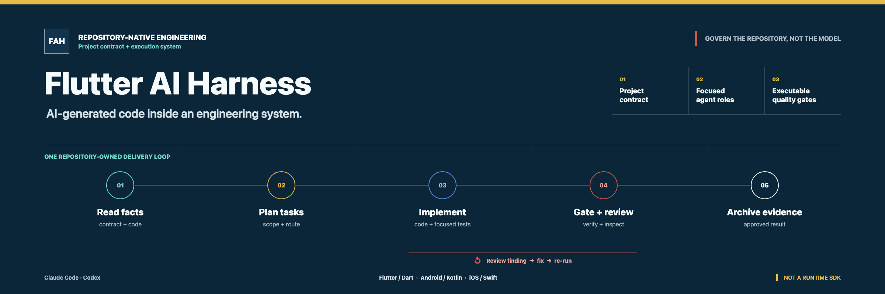

# Flutter AI Harness



**[阅读详细指南](https://htmlpreview.github.io/?https://github.com/bladeofgod/flutter-ai-harness/blob/main/docs/zh-CN/index.html)** · [English README](../README.md)

面向生产级 Flutter 与混合移动应用仓库的 AI 原生工程 Harness。

Flutter AI Harness 帮助编码 Agent 在明确、可测试的工程边界内工作。它将仓库内的项目契约、聚焦的 Agent 角色、任务产物、审查闭环和可执行质量门禁组合成一套工程系统。本项目用于通过 AI Agent 构建应用，不是在 Flutter App 内增加 AI 功能的运行时 SDK。

这份 README 是项目采用的主要入口和项目预览。[详细指南](https://htmlpreview.github.io/?https://github.com/bladeofgod/flutter-ai-harness/blob/main/docs/zh-CN/index.html)将持续承载系统模型、交付流程、安全审查、参考实现、采用方式和后续扩展内容。

## 这个仓库是什么

AI Harness 是一套运行在代码仓库之上的 AI 工程制度和执行系统。Flutter Demo 是它的第一个被治理对象和参考实现，不是 Harness 本身。

```text
AI Harness
├── 项目契约：架构边界、编码规则、安全策略
├── 工作流：规划、执行、Review、修复、归档、发版检查
├── 任务系统：任务卡、依赖、执行者、验收条件
├── Agent 系统：架构师、执行者、Reviewer、安全 Reviewer
├── 质量门禁：静态检查、测试、构建、证据、CI
├── AI 工具适配：Claude Code / Codex
└── 参考技术栈与适配
    ├── Flutter / Dart
    ├── Android / Kotlin
    └── iOS / Swift
```

真正可复用的是项目契约、交付工作流、Agent 协作模型和可执行质量闭环。Flutter、Android 与 iOS 构成当前用于实践和验证这套系统的参考环境。

## 在你的工程中使用 Harness

在你准备创建或改进的目标工程目录中启动编码 Agent，不要把 Flutter Demo 克隆进目标工程。Agent 把本仓库作为参考输入，先生成采用方案，只有得到你的批准后才修改目标工程。

本仓库目前正式提供 Claude Code 与 Codex 项目入口。其他编码 Agent 只有在具备等价的文件系统、终端和指令控制能力时，才能遵循同一套工具中立协议。

### 1. 在目标目录中启动 Agent

```bash
cd path/to/your-project
# 在这里启动 Claude Code、Codex 或具备等价能力的编码 Agent。
```

### 2. 粘贴启动提示词

```text
请将以下 AI Harness 的工程模式适配到当前目录：

https://github.com/bladeofgod/flutter-ai-harness.git

当前目录是目标项目，Harness 仓库只是参考输入。第一阶段保持目标目录只读：
不要修改目标文件、安装依赖、初始化项目、提交或推送。唯一允许的写入是将 Harness
克隆到目标目录之外的临时目录；不要执行来源仓库脚本。记录实际使用的精确 Commit，
并遵循 docs/adoption/AGENT_BOOTSTRAP.zh-CN.md。

如果当前目录是已有工程，先审计技术栈、架构、项目指令、测试、CI 和已有改动，
再提出适配方案。如果当前目录为空，先与我讨论产品需求、目标端、技术约束、
部署方式、团队能力和质量要求；技术栈和项目边界得到我批准前，不得初始化工程。
如果目录状态无法判断，先询问我如何处理。

不要复制 Flutter Demo、业务代码、归档任务、Review 或证据。请输出采用方案、
计划修改文件、验证命令、冲突和未决问题，然后停止并等待我批准。
```

### 3. 批准后才能实施

检查技术栈建议和采用方案。确认无误后继续输入：

```text
按照已批准的采用方案实施。保持目标工程已确认的技术栈和项目契约权威，
只采用存在真实消费者的能力，保护已有改动，并执行目标技术栈检查。
准确报告无法验证的平台和不可用环境。未经我明确要求，不提交、不推送。
```

```text
目标目录
├── 已有工程 -> 只读审计 -> 采用方案 -> 用户批准 -> 实施
├── 空目录   -> 需求和技术栈讨论 -> 初始化方案 -> 用户批准 -> 实施
└── 模糊目录 -> 询问用户并停止
```

完整规则见 [Agent 采用协议](./adoption/AGENT_BOOTSTRAP.zh-CN.md)、[已有工程路径](./adoption/existing-project.zh-CN.md)和[新工程路径](./adoption/new-project.zh-CN.md)。采用结果归目标仓库所有，本仓库不会成为它的运行时依赖。

## 核心概览

- 以一份权威项目契约为事实源，并生成 Codex 原生 Skill 与 Agent 适配。
- 覆盖任务规划、Figma 拆解、实现、审查、按风险触发的安全审查和发版检查。
- 用仓库内架构门禁、Git Hooks、证据采集和 CI 检查约束交付过程。
- 通过分层 Flutter Workspace 明确 Package、数据、路由和依赖注入边界。
- 将 Android 和 iOS 作为一等宿主，并采用契约优先的平台通道规范。
- 可选接入 Figma 和 Marionette，读取设计上下文并执行人工明确安排的 UI 验证。

```text
产品输入或 Figma
        -> 任务卡
        -> 实现与聚焦测试
        -> 独立审查
        -> 显式修复与复审
        -> 归档证据
```

## 运行参考 Demo

运行 Demo 是可选路径。它用于查看任务卡、Review、证据、架构门禁和 Flutter/Android/iOS 集成的完整实例，不是采用 Harness 的前置条件。

前置环境：使用仓库 Claude 工作流时需要 Claude Code 2.1.198 或更高版本；此外需要 `ripgrep`，以及 FVM 或 Flutter 3.41.9。

```bash
git clone https://github.com/bladeofgod/flutter-ai-harness.git
cd flutter-ai-harness
make setup
make check
```

运行使用本地 Fixture 的 Demo：

```bash
TOOL_WORKDIR=app/apps/demo bash scripts/flutter-tool.sh run
```

完整说明见[参考工程评估路径](./adoption/evaluation.zh-CN.md)。

### Demo 预览

> **自动化开发记录：** 当前 Demo 在一个通宵内完成，执行阶段没有人工介入代码实现。人工输入仅包括设计稿选择、范围确认和环境操作。

<table>
  <tr>
    <td></td>
    <td></td>
  </tr>
  <tr>
    <td></td>
    <td></td>
  </tr>
</table>

`Android Debug · 确定性本地 Fixture · 四段连续预览 · 原始录制时长：1 分 13 秒`

Shoppe 风格 Demo 包含 Welcome、Auth、Shop、Categories、Product Detail、Wishlist、Cart、Checkout、Profile、Settings、Orders、Search、Promotions、Rewards 和 Support 流程。它的任务卡、Review、实现证据和项目文档均由 Harness 的实际工作流产生，不是预先编写的占位历史。

设计稿来源：[Shoppe Community 设计稿](https://www.figma.com/community/file/1321464360558173342/shoppe-ecommerce-clothing-fashion-store-multi-purpose-ui-mobile-app-design)。来源与许可记录见 [`docs/figma-links.md`](./figma-links.md)。

## 仓库结构

```text
flutter-ai-harness/
├── CLAUDE.md     权威项目契约
├── .claude/      Command、Agent、Skill 和 Memory
├── .agents/      生成的 Codex Skill 适配
├── .codex/       生成的 Codex 项目 Agent
├── docs/         详细指南、架构、任务卡与 Review
├── scripts/      Hooks 和可执行质量门禁
└── app/          Flutter Workspace 与参考 Demo
```

## 继续了解

- [Agent 采用协议](./adoption/AGENT_BOOTSTRAP.zh-CN.md)
- [在已有工程中采用](./adoption/existing-project.zh-CN.md)
- [使用 Harness 创建新工程](./adoption/new-project.zh-CN.md)
- [设计与采用详细指南](https://htmlpreview.github.io/?https://github.com/bladeofgod/flutter-ai-harness/blob/main/docs/zh-CN/index.html)
- [权威项目契约](../CLAUDE.md)
- [应用架构](./architecture.md)
- [背景文章：AI 编程的工程化实践](https://mp.weixin.qq.com/s/XAV8U9SfvbGgsAC5Tj2GEA)

## 当前状态

Harness 基线、Demo UI、Flutter 媒体资源与 Android/iOS 原生拍摄集成已经实现。应用使用确定性本地业务数据，不代表生产服务；Android Debug APK 与 iOS no-codesign Runner 已通过构建。Android 模拟器/真机拍摄流程，以及 iOS Camera、Microphone、系统中断与性能仍保留为人工设备验收项。

## 许可证

Flutter AI Harness 使用 [MIT License](../LICENSE)。
